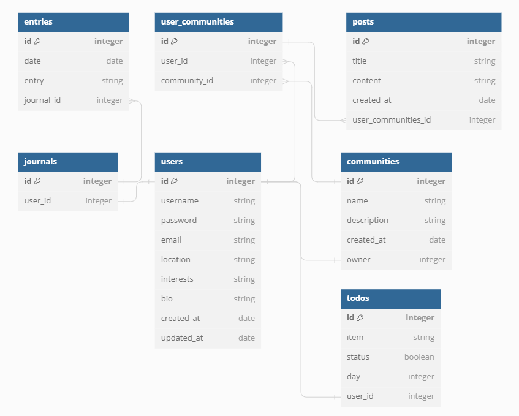

# Virtual Planner

## Home

* [Introduction](#introduction)
* [Starting the Application](#starting-the-application)
* [.env Set Up](#.env-set-up)
* [Configuring the Database](#configuring-the-database)
* [Starting the server](#starting-the-server)
* [Starting the client](#starting-the-client)
* [Using the application](#using-the-application)
* [Attributions](#attributions)

## Introduction

- This is a full-stack web application that allows a user to use a planner, write a journal, and join a community
- This project was made to complete the assignment `Phase 4 Project` for the `SE-West-091123` class for the [Flatiron](https://flatironschool.com/) Software Engineering Boot Camp
- The frontend was created using `React.js`
- The backend was created using `Python` and `Flask`

---

## Starting the application

1. Fork and clone this repository from Github to your local environment
2. Navigate into your local directory and open the contents using your preferred code editor
3. Run `pipenv install` to install the dependencies
4. Run `pipenv shell` to create a virtual environment

### .env Set Up
1. Inside your main directory, create a file and name it `.env` by running `touch .env` in your terminal
2. Inside the `.env` file, add this line: `APP_SECRET=`
3. In your terminal, run `python -c 'import secrets; print(secrets.token_hex())'` to generate your own secret key
4. Copy the string and paste it after the `=`. It should look something like `APP_SECRET='f440a395514e01d80d85c94c4d711cc7ddbbb8073e0e5e9541c005045fc75ef7'`
5. In your `.gitignore` file, make sure you add this line somewhere: `.env`. This will keep your secret key on your local computer

### Configuring the Database

In `server/models`, we define the relationships shown in the picture above between our classes and a SQLite database. Follow the instructions below to initialize the database

1. In your terminal, navigate into the `server` directory using `cd server/`
2. Run these lines of code in your terminal in the order they are presented
- `export FLASK_APP=app.py` and `export FLASK_RUN_PORT=5555`
- `flask db init`
- `flask db migrate -m 'initial migration'`
- `flask db upgrade head`
3. Run `python seed.py` to seed the database with some information

### Starting the server
- Run `python app.py` within the `server` directory to start the server

### Starting the client
1. In a separate terminal, enter the virtual environment by running `pipenv shell`
2. Run `npm install --prefix client` to install dependencies
3. Run `npm start --prefix client` to open the application in your browser

## Using the application
Once the application is started, you will be navigated to a registration page where you can create an account or log in to a pre-existing user.

Once logged in, you are navigated to your dashboard. Here, you can write out a to-do list and create a journal entry for today. You can change the view by pressing the `Week View` button and you will see 6 extra lists for the rest of your week in addition to today's list. You can edit your task by clicking on your task twice and delete your task by clicking the `X`

You can use the navigation bar at the top to route to a journal page, communities page, profile page, and logout.

Within the `journal` page, you can view all of your entries and edit the entry for today only.

Within the `commmunities` page, you can view the communities that exist and join a community that interests you! Within a community, you can view other posts as well as create your own post.

Within the `profile` page, you can view your user information and edit your username, location, and bio.

## License

- This project is is made in conjunction with the standard `MIT` license provided by `GitHub` upon creation of a new repository. A copy of the license is included with this project in a file named: `LICENSE`.

## Attributions

- The project was authored by: `Anthony Bosek`, `Tiana Lopez`, and `Isaac Song`
